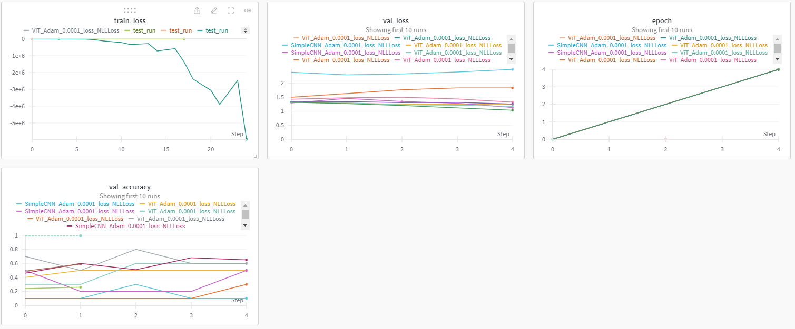
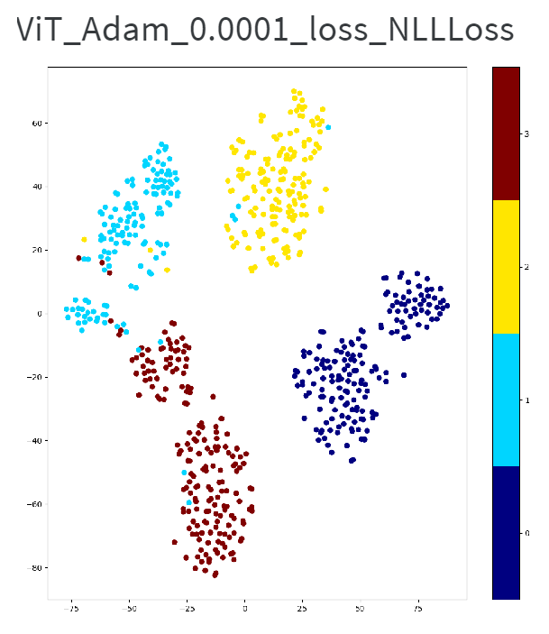
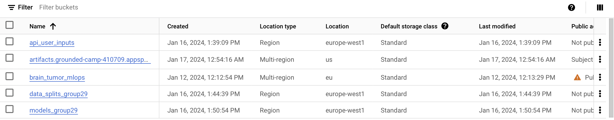
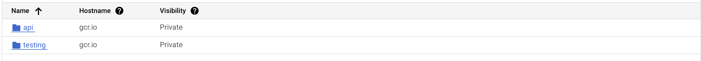

# Exam template for 02476 Machine Learning Operations

This is the report template for the exam. Please only remove the text formatted as with three dashes in front and behind
like:

```--- question 1 fill here ---```

where you instead should add your answers. Any other changes may have unwanted consequences when your report is auto
generated in the end of the course. For questions where you are asked to include images, start by adding the image to
the `figures` subfolder (please only use `.png`, `.jpg` or `.jpeg`) and then add the following code in your answer:

```markdown

```

In addition to this markdown file, we also provide the `report.py` script that provides two utility functions:

Running:

```bash
python report.py html
```

will generate an `.html` page of your report. After deadline for answering this template, we will autoscrape
everything in this `reports` folder and then use this utility to generate an `.html` page that will be your serve
as your final handin.

Running

```bash
python report.py check
```

will check your answers in this template against the constrains listed for each question e.g. is your answer too
short, too long, have you included an image when asked to.

For both functions to work it is important that you do not rename anything. The script have two dependencies that can
be installed with `pip install click markdown`.

## Overall project checklist

The checklist is *exhaustic* which means that it includes everything that you could possible do on the project in
relation the curricilum in this course. Therefore, we do not expect at all that you have checked of all boxes at the
end of the project.

### Week 1

* [x] Create a git repository
* [x] Make sure that all team members have write access to the github repository
* [x] Create a dedicated environment for you project to keep track of your packages
* [x] Create the initial file structure using cookiecutter
* [x] Fill out the `make_dataset.py` file such that it downloads whatever data you need and
* [x] Add a model file and a training script and get that running
* [x] Remember to fill out the `requirements.txt` file with whatever dependencies that you are using
* [x] Remember to comply with good coding practices (`pep8`) while doing the project
* [x] Do a bit of code typing and remember to document essential parts of your code
* [x] Setup version control for your data or part of your data
* [x] Construct one or multiple docker files for your code
* [x] Build the docker files locally and make sure they work as intended
* [x] Write one or multiple configurations files for your experiments
* [x] Used Hydra to load the configurations and manage your hyperparameters
* [ ] When you have something that works somewhat, remember at some point to to some profiling and see if
      you can optimize your code
* [x] Use Weights & Biases to log training progress and other important metrics/artifacts in your code. Additionally,
      consider running a hyperparameter optimization sweep.
* [x] Use Pytorch-lightning (if applicable) to reduce the amount of boilerplate in your code

### Week 2

* [x] Write unit tests related to the data part of your code
* [x] Write unit tests related to model construction and or model training
* [x] Calculate the coverage.
* [x] Get some continuous integration running on the github repository
* [x] Create a data storage in GCP Bucket for you data and preferable link this with your data version control setup
* [x] Create a trigger workflow for automatically building your docker images
* [x] Get your model training in GCP using either the Engine or Vertex AI
* [x] Create a FastAPI application that can do inference using your model
* [ ] If applicable, consider deploying the model locally using torchserve
* [x] Deploy your model in GCP using either Functions or Run as the backend

### Week 3

* [x] Check how robust your model is towards data drifting
* [ ] Setup monitoring for the system telemetry of your deployed model
* [ ] Setup monitoring for the performance of your deployed model
* [ ] If applicable, play around with distributed data loading
* [ ] If applicable, play around with distributed model training
* [ ] Play around with quantization, compilation and pruning for you trained models to increase inference speed

### Additional

* [ ] Revisit your initial project description. Did the project turn out as you wanted?
* [ ] Make sure all group members have a understanding about all parts of the project
* [ ] Uploaded all your code to github

## Group information

### Question 1
> **Enter the group number you signed up on <learn.inside.dtu.dk>**
>
> Answer:

29

### Question 2
> **Enter the study number for each member in the group**
>
> Example:
>
> *sXXXXXX, sXXXXXX, sXXXXXX*
>
> Answer:

s230368, s204209, s233472, s204231

### Question 3
> **What framework did you choose to work with and did it help you complete the project?**
>
> Answer length: 100-200 words.
>
> Example:
> *We used the third-party framework ... in our project. We used functionality ... and functionality ... from the*
> *package to do ... and ... in our project*.
>
> Answer:

Our project leveraged Hugging Face, a third-party framework chosen for its practicality, effectiveness, and accessibility of open-source machine learning models. We utilized the pre-trained Vision Transformer (ViT) model, adapting it for our specific task of brain tumor classification. This adaptation involved adding an initial layer to convert 1-channel grayscale images into 3-channel images, aligning with ViT's input requirements. Additionally, we replaced the final classification layer with one tailored to four classes.

This approach allowed us to efficiently incorporate the model into a PyTorch Lightning module. The significant advantage of using pre-trained weights meant we could fine-tune the model for our task without extensive training time. This was particularly beneficial as we lacked access to GPU resources, making training such a large model from scratch impractical and time-consuming. Our method enabled us to implement a complex model effectively, overcoming hardware limitations.

## Coding environment

> In the following section we are interested in learning more about you local development environment.

### Question 4

> **Explain how you managed dependencies in your project? Explain the process a new team member would have to go**
> **through to get an exact copy of your environment.**
>
> Answer length: 100-200 words
>
> Example:
> *We used ... for managing our dependencies. The list of dependencies was auto-generated using ... . To get a*
> *complete copy of our development environment, one would have to run the following commands*
>
> Answer:

In our project, we chose Conda as the primary package manager to create and manage a virtual environment tailored for our development needs, ensuring consistency across various setups. Our project's core dependencies were initially generated using pipreqs. However, pipreqs sometimes misses essential packages that are critical for background operations. To counter this, we manually added these packages to the auto-generated list.

To replicate our development environment, a new team member should:

1. Clone the git repository and navigate to the project folder.
2. Create a new Conda environment and install the requirements using one of the following methods:

Using shell commands:
```bash
git clone https://github.com/Kasperjoergensen3/MLOps_project.git
cd MLOps_project
conda create --name $(PROJECT_NAME) python=3.11 --no-default-packages -y
conda activate $(PROJECT_NAME)
pip install -U pip setuptools wheel
pip install -r requirements.txt
pip install -e .
```

or using make commands
```bash
make create_environment
make requirements
```


### Question 5

> **We expect that you initialized your project using the cookiecutter template. Explain the overall structure of your**
> **code. Did you fill out every folder or only a subset?**
>
> Answer length: 100-200 words
>
> Example:
> *From the cookiecutter template we have filled out the ... , ... and ... folder. We have removed the ... folder*
> *because we did not use any ... in our project. We have added an ... folder that contains ... for running our*
> *experiments.*
> Answer:

From the cookiecutter template we have filled out the .dvc, .github/workflows, dockerfiles, tests and src. In the src folder we have filled out all the subfolders - conf, data, models, utilities and visualizations. In the src folder we have added a callbacks folder that contains a python script that plots the callbacks. We have also added an API folder that contains the fastAPI script, html structure and a requirements.txt for the fastAPI. We don't think we have removed any folders. The folders that aren't used are just left empty. In the root folder we have also added data.dvc, models.dvc a Makefile and much more.

### Question 6

> **Did you implement any rules for code quality and format? Additionally, explain with your own words why these**
> **concepts matters in larger projects.**
>
> Answer length: 50-100 words.
>
> Answer:

We have used the open source package called Ruff, which is "_An extremely fast Python linter and code formatter, written in Rust_". Ruff enforces a consistent code style, enhancing readability and collaboration for developers. Consistent code also aids automated testing and debugging, ensuring robustness in larger projects. This proactive approach to code quality streamlines development workflows, fosters maintainability, and ultimately contributes to a more efficient and scalable software development process. We have added Ruff to our github workflow to automatically perform formating as well as (attempting to) fix linting errors. See ruff.yml in .github/workflows.

## Version control

> In the following section we are interested in how version control was used in your project during development to
> corporate and increase the quality of your code.

### Question 7

> **How many tests did you implement and what are they testing in your code?**
>
> Answer length: 50-100 words.
>
> Example:
> *In total we have implemented X tests. Primarily we are testing ... and ... as these the most critical parts of our*
> *application but also ... .*
>
> Answer:

We have run 14 pytest tests, with a primary emphasis on data, SimpleCNN model, and app functionality. These tests assess data integrity, model architecture, and application behavior, guaranteeing the robustness and accuracy of our system. The regular integration of these tests plays a crucial role in quickly identifying and addressing any potential issues, contributing to the overall reliability and performance of our project.

### Question 8

> **What is the total code coverage (in percentage) of your code? If you code had an code coverage of 100% (or close**
> **to), would you still trust it to be error free? Explain you reasoning.**
>
> Answer length: 100-200 words.
>
> Example:
> *The total code coverage of code is X%, which includes all our source code. We are far from 100% coverage of our **
> *code and even if we were then...*
>
> Answer:

Our current code coverage is **51**%. So **51**% is covered by automated tests when pushing to github. While a higher code coverage percentage is generally desirable, achieving 100% coverage doesn't guarantee a completely error-free code. Code coverage primarily measures the proportion of code touched by tests, but it doesn't necessarily account for all possible scenarios and edge cases. Even with close to 100% coverage, there could be subtle bugs, unhandled edge cases, or integration issues that tests might not catch. Comprehensive testing involves not only achieving high coverage but also designing tests that thoroughly explore various code paths and scenarios.

### Question 9

> **Did you workflow include using branches and pull requests? If yes, explain how. If not, explain how branches and**
> **pull request can help improve version control.**
>
> Answer length: 100-200 words.
>
> Example:
> *We made use of both branches and PRs in our project. In our group, each member had an branch that they worked on in*
> *addition to the main branch. To merge code we ...*
>
> Answer:

We made use of branches one time, when working on the dockerfiles. One pull request was also made to merge to the main branch. Afterwards the branch was deleted. Retrospectively it might have been smarter to just keep the branch, if we wanted to work further with the dockerfiles or something else. Generally branches in version control allow developers to work on features or fixes independently, preventing conflicts. Pull requests provide a mechanism to propose and review changes before merging them into the main codebase. This ensures code quality, collaboration, and easy rollback if needed. Together, branches and pull requests enhance collaboration, streamline development workflows, and maintain a clean and stable version control history.

### Question 10

> **Did you use DVC for managing data in your project? If yes, then how did it improve your project to have version**
> **control of your data. If no, explain a case where it would be beneficial to have version control of your data.**
>
> Answer length: 100-200 words.
>
> Example:
> *We did make use of DVC in the following way: ... . In the end it helped us in ... for controlling ... part of our*
> *pipeline*
>
> Answer:

Employing Data Version Control (DVC) in our project improved data management. DVC allowed us to version and share datasets efficiently, ensuring reproducibility and traceability. By tracking changes to data files separately from code, it enhanced collaboration and made it easier to roll back to previous data states if necessary. However this wasn't necessary in our case. A case could be a deep learning project where one regularly updates a dataset. With DVC, one can version-control the data, ensuring each change is tracked. If a model trained on a specific dataset version yields unexpected results, DVC allows one to revert to a previous version, aiding in debugging and maintaining reproducibility.

### Question 11

> **Discuss you continues integration setup. What kind of CI are you running (unittesting, linting, etc.)? Do you test**
> **multiple operating systems, python version etc. Do you make use of caching? Feel free to insert a link to one of**
> **your github actions workflow.**
>
> Answer length: 200-300 words.
>
> Example:
> *We have organized our CI into 3 separate files: one for doing ..., one for running ... testing and one for running*
> *... . In particular for our ..., we used ... .An example of a triggered workflow can be seen here: <weblink>*
>
> Answer:

--- question 11 fill here ---

## Running code and tracking experiments

> In the following section we are interested in learning more about the experimental setup for running your code and
> especially the reproducibility of your experiments.

### Question 12

> **How did you configure experiments? Did you make use of config files? Explain with coding examples of how you would**
> **run a experiment.**
>
> Answer length: 50-100 words.
>
> Example:
> *We used a simple argparser, that worked in the following way: python my_script.py --lr 1e-3 --batch_size 25*
>
> Answer:

In our project, configuration management is orchestrated through two YAML files. The default_config.yaml serves as a baseline defining the model. To enhance experimentation, we employed Hydra and introduced sweep_config.yaml. This file does hyperparameter sweeping, specifically adjusting the learning rate with values in the range [0.001, 0.0001] and optimizer limited to "adam". The combined use of these configuration files optimizes hyperparameter exploration, offering a versatile and efficient approach to refining our model.

### Question 13

> **Reproducibility of experiments are important. Related to the last question, how did you secure that no information**
> **is lost when running experiments and that your experiments are reproducible?**
>
> Answer length: 100-200 words.
>
> Example:
> *We made use of config files. Whenever an experiment is run the following happens: ... . To reproduce an experiment*
> *one would have to do ...*
>
> Answer:

We incorporated config files managed by Hydra and set a random seed to ensure consistency in our experiments. Additionally, we utilized Docker to package our experiments (like training and prediction scripts) into reproducible containers. These containers build a specific virtual machine with designated hardware configurations and guarantee the use of consistent dependencies.

To replicate our experiments, one needs to build the Docker files stored in the Docker folder, where each experiment has its own file. Running these images on their system should ensure full reproducibility of the experiments. For those who prefer not to use Docker, an alternative is to manually replicate the virtual environment (as outlined in question 3) and rerun the training scripts with the specific configurations of the experiment they wish to reproduce. This flexibility allows for consistent and reproducible results, whether using Docker or a manual setup.

### Question 14

> **Upload 1 to 3 screenshots that show the experiments that you have done in W&B (or another experiment tracking**
> **service of your choice). This may include loss graphs, logged images, hyperparameter sweeps etc. You can take**
> **inspiration from [this figure](figures/wandb.png). Explain what metrics you are tracking and why they are**
> **important.**
>
> Answer length: 200-300 words + 1 to 3 screenshots.
>
> Example:
> *As seen in the first image when have tracked ... and ... which both inform us about ... in our experiments.*
> *As seen in the second image we are also tracking ... and ...*
>
> Answer:

The first image reveals four plots showing training loss, validation loss, epochs and validations accuarcy. The first graph charts training loss against optimization steps, where a general decline is observed, aligning with expectations. The second plot showcases the validation loss for both ViT and SimpleCNN models across numerous runs, assessing unseen validation data. Most models exhibit a declining validation loss per step. The third plot illustrates epochs in relation to steps. Lastly, the fourth plot depicts validation accuracy as a function of steps. Notably, an outlier model with unusually high accuracy may stem from a code bug. If one were to discard this outlier from the plot it would reveal a consistent increase in validation accuracy per step for the remaining models. The second image is a single T-SNE (t-Distributed Stochastic Neighbor Embedding) plot. T-SNE is smart since it is a visualization technique used to represent high-dimensional data in a lower-dimensional space, which is perfekt for us. In the plot one can see 4 different colors being plotted (blue, light blue, yellow and brown), which correspond to the 4 different types of brain tumors we are trying to classify (where one of them is no tumor). Here we see that the T-SNE plot splits up the 4 classes quite well, which indicates that our model has a good latent space. So the T-SNE plot is used to check if the latent space is good, which in turn affects how good our model is going to be.



### Question 15

> **Docker is an important tool for creating containerized applications. Explain how you used docker in your**
> **experiments? Include how you would run your docker images and include a link to one of your docker files.**
>
> Answer length: 100-200 words.
>
> Example:
> *For our project we developed several images: one for training, inference and deployment. For example to run the*
> *training docker image: `docker run trainer:latest lr=1e-3 batch_size=64`. Link to docker file: <weblink>*
>
> Answer:

Our project encompasses three essential Docker images, each serving a distinct purpose in our machine learning pipeline. The first image is dedicated to training the model, while the second facilitates predictions using the trained model from a specified checkpoint. The third image serves as an API container, seamlessly integrating with Google Cloud. For instance, executing the training Docker image involves a simple terminal command: 'docker run trainer:latest.' The beauty of this approach lies in the utilization of Hydra to load hyperparameters dynamically. To delve deeper into the intricacies of these Docker images, navigate to the 'dockerfiles' directory. There, you'll find detailed explanations for each image in the form of 'api.dockerfile,' 'predict_model.dockerfile,' and 'train_model.dockerfile.'

### Question 16

> **When running into bugs while trying to run your experiments, how did you perform debugging? Additionally, did you**
> **try to profile your code or do you think it is already perfect?**
>
> Answer length: 100-200 words.
>
> Example:
> *Debugging method was dependent on group member. Some just used ... and others used ... . We did a single profiling*
> *run of our main code at some point that showed ...*
>
> Answer:

When running into bugs, we first look at the errors the code gave in the logs and take action accordingly. Sometimes it was a package that wasn't imported or simply a small mistake in the code. If the error was more complex, we used chatGPT and Google to diagnose the error further. There was one instance where running the predict_model docker image in a container locally caused memory isssues. We found this error after looking at the logs, which gave exit code 137 (OutOfMemory). This was then confirmed when using resource monitoring for the container. After fixing the predict_model.dockerfile the memory issue was fixed.

## Working in the cloud

> In the following section we would like to know more about your experience when developing in the cloud.

### Question 17

> **List all the GCP services that you made use of in your project and shortly explain what each service does?**
>
> Answer length: 50-200 words.
>
> Example:
> *We used the following two services: Engine and Bucket. Engine is used for... and Bucket is used for...*
>
> Answer:

In our project, we utilized three key services: Engine, Bucket, and Cloud Run, each serving a specific purpose:
1. Engine: This service was primarily used for model training. The process involved cloning our git repository onto the Engine, pulling the necessary data, and building Docker images from the experiment-specific Dockerfiles. Although the Engine provided more computing power than our laptops, it's important to note that we still didn't have access to GPU quotas.
2. Bucket: This service was employed to store various types of data, including raw data, model checkpoints, and API interaction data. A major advantage of using Bucket was the elimination of the need to pack data or model checkpoints into Docker files, which helped in keeping the image file sizes manageable.
3. Cloud Run: We used Cloud Run for deploying our final API application. This service allowed us to efficiently deploy and manage our application in the cloud.

### Question 18

> **The backbone of GCP is the Compute engine. Explained how you made use of this service and what type of VMs**
> **you used?**
>
> Answer length: 100-200 words.
>
> Example:
> *We used the compute engine to run our ... . We used instances with the following hardware: ... and we started the*
> *using a custom container: ...*
>
> Answer:

The foundation of our Google Cloud Platform (GCP) infrastructure lies in the Compute Engine. Leveraging this service, we configured a compute engine to efficiently handle various tasks within our project. This compute engine was specifically designed to clone our repository, pull necessary data, and ensure readiness for running diverse scripts, particularly the training script, along with other functionalities from our GitHub repository. In terms of the virtual machines (VMs) employed, we opted for instances featuring robust hardware specifications. These included a 50 GB disk, 2 virtual CPUs (vCPU), 1 core, and 8 GB of memory. Our VMs were based on the c0-deeplearning-common-cpu-v20230925-debian-10 image, which provided a reliable and optimized environment for our deep learning workflows.

### Question 19

> **Insert 1-2 images of your GCP bucket, such that we can see what data you have stored in it.**
> **You can take inspiration from [this figure](figures/bucket.png).**
>
> Answer:

Here is a screen shot of different buckets used in the project:


1. api_user_inputs: This bucket contains an 'inputs.csv' file, which logs all API user interactions. It records input images, measures, model performance metrics, and timestamps. Additionally, it houses images of performance visualizations and an HTML file linked to the Evidently-generated data drift report. These files are dynamically updated during API interactions, ensuring real-time tracking and analysis of user engagement and model performance.
2. models_group29: This is a dedicated bucket for storing model checkpoints and their respective configuration files. Model weights are loaded from this bucket, ensuring a streamlined process for retrieving the latest and relevant model data for various tasks, such as training, validation, or deployment.
3. data_splits_group29: This bucket contains all raw and processed data splits. It is the primary source for our data version control, as we perform 'dvc pull` operations from this container. This approach ensures that everyone working on the project has access to the same data versions, promoting consistency and reproducibility in our data-driven tasks.
4. the rest is not relevant for this project.

### Question 20

> **Upload one image of your GCP container registry, such that we can see the different images that you have stored.**
> **You can take inspiration from [this figure](figures/registry.png).**
>
> Answer:

here is a screen shot of different container registry for this project.


1. api: contains different different packed versions of the API.
2. testing: contains small size containers which was used for for debugging

### Question 21

> **Upload one image of your GCP cloud build history, so we can see the history of the images that have been build in**
> **your project. You can take inspiration from [this figure](figures/build.png).**
>
> Answer:

--- question 21 fill here ---

### Question 22

> **Did you manage to deploy your model, either in locally or cloud? If not, describe why. If yes, describe how and**
> **preferably how you invoke your deployed service?**
>
> Answer length: 100-200 words.
>
> Example:
> *For deployment we wrapped our model into application using ... . We first tried locally serving the model, which*
> *worked. Afterwards we deployed it in the cloud, using ... . To invoke the service an user would call*
> *`curl -X POST -F "file=@file.json"<weburl>`*
>
> Answer:

--- question 22 fill here ---

### Question 23

> **Did you manage to implement monitoring of your deployed model? If yes, explain how it works. If not, explain how**
> **monitoring would help the longevity of your application.**
>
> Answer length: 100-200 words.
>
> Example:
> *We did not manage to implement monitoring. We would like to have monitoring implemented such that over time we could*
> *measure ... and ... that would inform us about this ... behaviour of our application.*
>
> Answer:

--- question 23 fill here ---

### Question 24

> **How many credits did you end up using during the project and what service was most expensive?**
>
> Answer length: 25-100 words.
>
> Example:
> *Group member 1 used ..., Group member 2 used ..., in total ... credits was spend during development. The service*
> *costing the most was ... due to ...*
>
> Answer:

Jonatan used 17$, Kasper used 9.85$, Asger used 2.67$ and Alexander used all 50$ because he created too many VMs and let them sit idle overnight😅. In total 79.5$ was spent during development.

## Overall discussion of project

> In the following section we would like you to think about the general structure of your project.

### Question 25

> **Include a figure that describes the overall architecture of your system and what services that you make use of.**
> **You can take inspiration from [this figure](figures/overview.png). Additionally in your own words, explain the**
> **overall steps in figure.**
>
> Answer length: 200-400 words
>
> Example:
>
> *The starting point of the diagram is our local setup, where we integrated ... and ... and ... into our code.*
> *Whenever we commit code and puch to github, it auto triggers ... and ... . From there the diagram shows ...*
>
> Answer:

--- question 25 fill here ---

### Question 26

> **Discuss the overall struggles of the project. Where did you spend most time and what did you do to overcome these**
> **challenges?**
>
> Answer length: 200-400 words.
>
> Example:
> *The biggest challenges in the project was using ... tool to do ... . The reason for this was ...*
>
> Answer:

--- question 26 fill here ---

### Question 27

> **State the individual contributions of each team member. This is required information from DTU, because we need to**
> **make sure all members contributed actively to the project**
>
> Answer length: 50-200 words.
>
> Example:
> *Student sXXXXXX was in charge of developing of setting up the initial cookie cutter project and developing of the*
> *docker containers for training our applications.*
> *Student sXXXXXX was in charge of training our models in the cloud and deploying them afterwards.*
> *All members contributed to code by...*
>
> Answer:

--- question 27 fill here ---
